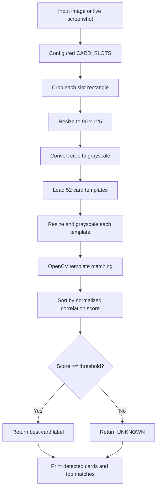
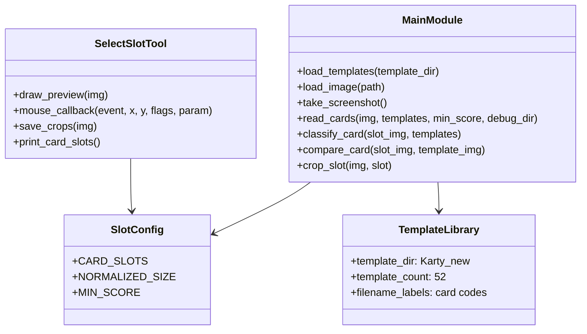

# Card_Clas

Card_Clas is a small Python card reader for poker screenshots. It reads fixed
screen regions, compares each crop against a local template library, and prints
the most likely card for each configured slot.

The project currently works as a simple slot-based reader. The bundled
configuration is set up for two card slots in `image.png`; it does not implement
full poker hand tracking, board-state persistence, or automatic card detection.

## What Works

- Reads a saved image with `python main.py --image image.png`.
- Can take a live screenshot when a screenshot backend is available.
- Classifies the configured slots in `CARD_SLOTS`.
- Uses the 52 card templates stored in `Karty_new/`.
- Saves cropped debug previews to `debug/`.
- Includes `select_slot.py` to measure new slot rectangles for another
  screenshot layout.

## Installation

```bash
python -m venv .venv
source .venv/bin/activate
pip install -r requirements.txt
```

## Usage

Run the bundled sample image:

```bash
python main.py --image image.png
```

Expected sample result with the current slot configuration:

```text
Detected: ['2-D', '9-H']
```

Run the smoke test:

```bash
python match_test.py
```

Measure slots for a different screenshot:

```bash
python select_slot.py --image image.png
```

For a live screenshot instead of a file:

```bash
python select_slot.py --screenshot
python main.py
```

Copy the printed `CARD_SLOTS` list from `select_slot.py` into `main.py`.

## Model

The "model" is a deterministic OpenCV template-matching pipeline:

- `Karty_new/` contains 52 reference card images, one per poker card.
- Template filenames encode labels, for example `Ah.png`, `Td.png`, `2c.png`.
- Each input slot crop is resized and converted to grayscale.
- Each crop is compared against every template.
- The template with the highest normalized correlation score is selected.
- If the score is below the threshold, the result is reported as `UNKNOWN`.

## Hyperparameters

| Parameter | Value | Location |
| --- | --- | --- |
| Template matching method | `cv2.TM_CCOEFF_NORMED` | `compare_card()` |
| Normalized card size | `90 x 125` pixels | `NORMALIZED_SIZE` |
| Minimum known-card score | `0.80` | `MIN_SCORE`, override with `--min-score` |
| Reported alternatives | Top 5 matches | `classify_card()` |
| Input color conversion | BGR to grayscale | `normalize_card()` |
| Default template directory | `Karty_new/` | `TEMPLATE_DIR` |
| Bundled slot count | 2 slots | `CARD_SLOTS` |

## Pipeline



## UML Overview



## Limitations

- The reader only checks fixed rectangles; it does not locate cards
  automatically.
- Accuracy depends on matching the screenshot style, scale, and card artwork to
  the templates.
- The bundled slot coordinates are specific to the included `image.png`.
- The project does not track poker streets, hand history, flop/turn/river state,
  or gameplay decisions.
- Live screenshot mode depends on desktop/session permissions and either `mss`
  or Pillow's `ImageGrab`.
